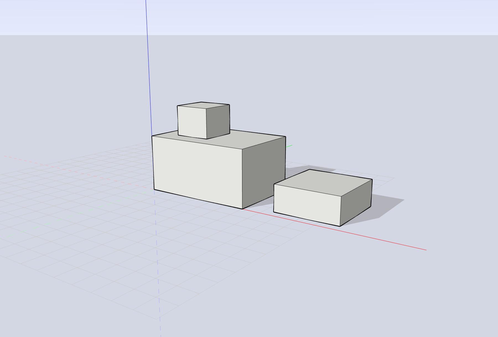

# Planura

A native **direct-modeling 3D application** — draw a plan, push/pull it
into space. Built from scratch in **C++20 / Qt 6 / OpenGL**: a half-edge
geometry kernel, an inference-driven drawing system, and an event-driven
agent architecture.



## Features

- **Drawing toolset** — Line, Rectangle, Rotated Rectangle, Circle, Polygon,
  Arc (3 variants), Pie, Freehand, 3D Text, with typed exact dimensions
  (measurements box) on every tool
- **Inference engine** — endpoint / midpoint / intersection / on-edge /
  on-face snapping, axis alignment with screen-space direction gates,
  parallel & perpendicular locks, hover-charged "from point" alignment,
  guide lines and a relocatable drawing-axes frame
- **Solid modeling** — Push/Pull with live preview (additive prisms on
  sheets, face-move carving on closed solids), Move / Rotate / Scale /
  Offset / Flip / Follow Me, edge-intersection face splitting
- **Solid tools (CSG)** — Union, Subtract, Intersect, Trim, Split and
  Outer Shell on closed manifolds, with a BSP-clipping boolean core and
  watertightness verification
- **Materials & display** — paint bucket with textured materials, six face
  styles (wireframe → x-ray), profile/depth-cue/back-edge line styles,
  sun-position face shading, ground shadows, linear fog and SSAO
- **Scene management** — groups, tags with visibility control, section
  planes, dimensions and annotations
- **Cameras** — perspective / parallel / two-point projection, standard
  views, cursor-anchored zoom, view history, sky backdrop
- **Persistence** — native `.plr` format (ZIP container, deterministic
  JSON), delta-journaled undo/redo, OBJ import/export

## Architecture

```
src/
  framework/ordo/   Ordo — an event-driven application framework:
                    AppKernel + Dispatcher route typed events between
                    Agents (state + specialist-API wrappers), stateless
                    Commands (control flow) and Presenters (UI binding)
  geometry/         Qt-free half-edge kernel: modeling ops, inference,
                    picking, triangulation, CSG, journaling
  app/
    agent/          application state layer (16 agents) + commands
    tools/          25+ interactive tools over a shared ToolContext seam
    viewport/       OpenGL 3.3 core renderer: multi-pass edge styles,
                    planar shadows, SSAO pipeline, sky backdrop
    io/             .plr reader/writer, OBJ interchange
    ui/             presenters for tray panels, menus, status bar
tests/              829 unit tests (GoogleTest) across every layer
```

Key design rules: the geometry kernel never sees Qt; state mutations flow
through events (`*Requested` intents → Commands → Agents → `*Changed`
facts); the renderer re-derives everything from agent state, never the
reverse. Undo is delta-journaled at the kernel seam rather than
snapshot-based.

The full normative architecture — layer diagrams, the event loop contract,
undo/redo and `.plr` format rules, per-section review checklists — lives in
[docs/ARCHITECTURE.md](docs/ARCHITECTURE.md).

## Download

A portable Windows build (no installation required) is attached to each
[GitHub Release](../../releases) — unzip and run `planura.exe`.

## Building

Requirements: Qt 6.11+, CMake 3.24+, Ninja. The codebase is
platform-neutral C++20 / Qt / OpenGL; Windows (MinGW 64-bit kit) is the
built-and-tested platform.

```
cmake -S . -B build -G Ninja -DCMAKE_PREFIX_PATH=<Qt>/6.11.2/mingw_64
cmake --build build
ctest --test-dir build        # 829 tests
build/src/app/planura.exe
```

## Third-party

- [miniz](third_party/miniz) (MIT) — ZIP container backend, vendored
- GoogleTest (BSD-3) — fetched at configure time, tests only
- The Ordo framework (MIT) is developed as its own project and vendored in

## License

[GNU AGPL-3.0](LICENSE). Third-party components keep their own licenses
(miniz — MIT; GoogleTest — BSD-3; Qt — LGPLv3, dynamically linked).
