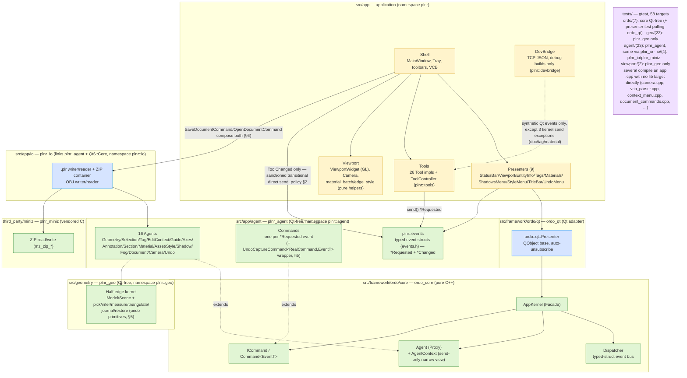
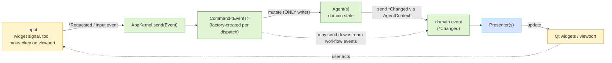
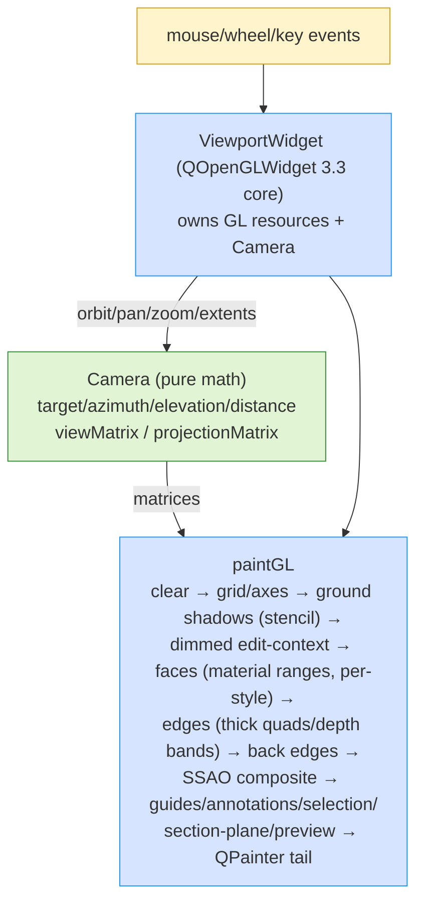

# Planura Architecture Overview

> **Purpose**: visual orientation for the planura codebase. One diagram per major axis, each acting as a **review gate** for changes in that area. As implementation complexity grows (geometry kernel, tools, undo), every change must fit these definitions — a change that doesn't fit updates this document *first*, then the code.
>
> **Use this doc when**: re-orienting after time away · reviewing an AI proposal · preparing an architectural change · deciding where new code belongs.
>

## How to use

1. Find the section relevant to your change.
2. Point at the box/arrow on the diagram that the change touches.
3. Apply the section's checklist (or §9 generic).
4. If the diagram doesn't have the answer, you're either in the wrong section or the diagram needs updating — don't proceed.

## Index

| § | Topic | Use when |
|---|-------|----------|
| [1](#1-module--responsibility-layers) | Module / responsibility layers | Deciding which library/namespace owns a change |
| [2](#2-ordo-unidirectional-event-loop) | Ordo unidirectional event loop | Adding any state, mutation, or UI reaction |
| [3](#3-event-conventions) | Event conventions | Defining or changing an event struct |
| [4](#4-viewport--camera) | Viewport & camera | Rendering, navigation, (later) picking |
| [5](#5-undoredo-architecture) | Undo/redo architecture | Adding or touching a mutating Intent; deciding whether a change is undo-worthy |
| [6](#6-file-io--the-plr-format-contract) | File I/O & the `.plr` format contract | Adding/changing a persisted field; touching document load/save |
| [7](#7-extension-placement-landed-and-next) | Extension placement — landed and next | Starting new work (what's already placed, what's still open) |
| [8](#8-where-to-look-first) | Topic → file orientation | Don't know where to start |
| [9](#9-generic-review-checklist) | Generic review checklist | Any architectural change |

---

## 1. Module / responsibility layers

**Layer rules** (don't violate without updating this doc):
- `ordo_core` includes **zero Qt headers** — std only. Enforced by not linking Qt; a PR that adds a Qt include to core is wrong by definition.
- `ordo_qt` is the only Ordo layer that touches Qt. `Presenter` is the only Ordo role holding a `QObject*`.
- `plnr_geo` (`plnr::geo`, `src/geometry/`) and `plnr_agent` (`plnr::agent`/`plnr::events`, `src/app/agent/`) are Qt-free the same way `ordo_core` is — `plnr_agent` links only `ordo_core` + `plnr_geo`, never Qt, so every `domain_*_test` runs without a `QApplication`.
- `plnr_io` (`plnr::io`, `src/app/io/`, v1.M10) is the one deliberate exception to "app code links Qt, domain doesn't": it links `plnr_agent` PUBLIC (to walk Agent state) *and* Qt6::Core PUBLIC (`QJsonDocument` is inherently a Qt type) — kept as its **own** library, sibling to `plnr_agent` rather than folded into it, specifically so `plnr_agent`'s Qt-free guarantee survives. The exe composes both (`document_commands.cpp`/`obj_commands.cpp`, compiled straight into the exe per the exe-side Qt-dependent command convention — see the source layout's Key files). `plnr_agent` must never link `plnr_io` back — that direction is both circular and a Qt-free violation.
- `plnr_miniz` (`third_party/miniz/`, vendored, v1.M11) is consumed by `plnr_io` PRIVATE only — the ZIP container is an `plnr_io`-internal implementation detail (`plr_container.cpp`), never exposed in any `plnr_io` public header.
- Dependency direction is one-way: `app → ordo_qt → ordo_core`, `app → plnr_agent → plnr_geo`/`ordo_core`, and `app → plnr_io → plnr_agent`/`plnr_geo`/`ordo_core` (`plnr_io → plnr_miniz` PRIVATE). Framework code never includes app code. `src/app/tools/tool.h` is the tools↔domain boundary: a `Tool` never includes a `agent/*_store.h` header or `ordo/app_kernel.h` directly — see the source layout's "Include-direction rules" for the full statement.
- App namespaces: `plnr` (app root — `MainWindow` lives here), `plnr::tools` (Tool/ToolController), `plnr::ui` (tray widgets, presenters, context menu), `plnr::viewport` (viewport/camera), `plnr::devbridge` (debug bridge), `plnr::io` (`.plr`/OBJ I/O). Domain: `plnr::agent` (Agents/Commands), `plnr::events` (events.h, physically under `src/app/agent/`). Geometry: `plnr::geo`. Framework: `ordo::core`, `ordo::qt`.
- Kernel is **instantiable, never a singleton** (multicore property: one kernel per document later). It is created in `main.cpp` and passed down by reference.
- AUTOMOC caveat for split `include/`+`src/` layouts: a `Q_OBJECT` header not next to its `.cpp` must be listed in the target's sources.

---

## 2. Ordo unidirectional event loop

> **Normative target — adopted since v1.M2.** The app now has 16 Agents (`src/app/agent/`: Geometry/Selection/Tag/EditContext/Guide/Axes/Annotation/Section from v1.M2–M9, plus Material/Asset/Style/Shadow/Fog/Document/Camera/Undo from v1.M10/M11) and a Command per `*Requested` event. The one still-standing exception is the original transitional flow: the tool-palette's QActions dispatch `ToolChanged` straight from `MainWindow` (`kernel_.send`) rather than through a `ToolStore` — sanctioned because no `ToolStore` exists yet (policy §2). Every other feature since v1.M3 follows this loop.

Every feature follows one loop. **There is exactly one write path to domain state.**

**Write-authority rules** (the anti-side-effect contract):
1. **Only Commands mutate Agents.** Presenters, widgets, and tools never write domain state directly — they `send()` an event that a Command handles. (Trivial view-local state — e.g. a collapsed tray section — is widget state, not domain state, and stays in the widget.)
2. **Presenters only render and forward.** A Presenter reacts to events by updating its view, and translates view signals into `send()` calls. It holds no domain state of its own.
3. **Agents hold state, not policy — and are send-only.** Business decisions live in Commands. The Agent whose data moved dispatches the `*Changed` fact itself, via its `AgentContext` (a kernel-owned narrow view exposing send + sibling-agent lookup only). An Agent *cannot* subscribe — `AgentContext` has no subscribe and the Agent never sees the `Dispatcher` (PureMVC's "Send Only, Never Listen", compile-time enforced).
4. **Dispatch is synchronous and single-threaded by design** (the app runs it on the UI thread; the Dispatcher itself has no locks and no thread-affinity check). No handler may re-dispatch the *same* event type it is handling — an unguarded honor-system rule. A Command may send *different* (downstream) events.
5. **One Command per event type per kernel** — re-registration replaces (documented in `app_kernel.h`).
6. Mid-dispatch subscribe/unsubscribe semantics are defined in `dispatcher.h` (snapshot + id re-check) — don't rely on anything stronger. Removal is by owner cookie in bulk; there is no per-subscription unsubscribe. The Dispatcher has a single **trace observer** slot (`DispatchRecord`) feeding the debug bridge's `events` query — trace-only by contract: an observer must never subscribe, unsubscribe, or dispatch.
7. **Undo capture wraps `registerCommand`, not the loop itself** (v1.M10, §5): `main.cpp` registers most mutating Intents as `UndoCaptureCommand<RealCommand, EventT>` rather than `RealCommand` directly — a decorator that snapshots around an unmodified `RealCommand::execute()` call. Rule 1 ("only Commands mutate Agents") still holds unchanged; this is a wrapping convention on *which* Command type gets registered, not a second write path.

**Section checklist**:
1. Is new state in an Agent (domain) or a widget (view-local)? Justify which.
2. Is every mutation inside a Command reached via `send()`?
3. Does the UI learn about it only through a `*Changed` event → Presenter?
4. Could the handler chain re-enter the same event type? (forbidden)

---

## 3. Event conventions

Events live in `src/app/agent/events.h` (`plnr::events`, 1442 lines), framework knows nothing about them.

- **The struct is the spec**: type = identity, members = payload. `static constexpr std::string_view eventName` is the debug identity — consumed by the Dispatcher's trace observer (`DispatchRecord` → debug bridge `events` query). No enum-as-event-identity, no `QVariant`, no `void*`. Shared value types used *inside* payloads (e.g. `ToolId`, `EntityRef`, `TransformSpec`) also live in `events.h` — an enum payload member is fine; an enum *as the event* is not.
- **Two families, both live since v1.M3**:
  - `*Requested` — an intent from input, consumed by exactly one Command (67 today: `AddEdgeRequested`, `ExtrudeFaceRequested`, `SelectRequested`, `TransformEntitiesRequested`, `FollowMeRequested`, `AddGuideLineRequested`, `SetAxesRequested`, `AddDimensionRequested`, `AddSectionPlaneRequested`, `DivideEdgeRequested`, `MaterialCreateRequested`, `PaintRequested`, `SetFaceStyleRequested`, `SetUseSunForShadingRequested`, `SetFogEnabledRequested`, `UndoRequested`/`RedoRequested`, `NewDocumentRequested`/`OpenDocumentRequested`/`SaveDocumentRequested`, `ExportObjRequested`/`ImportObjRequested`, ...).
  - `*Changed` — a fact after mutation (19 today: `GeometryChanged`, `SelectionChanged`, `TagsChanged`, `EditContextChanged`, `GuidesChanged`, `AxesChanged`, `AnnotationsChanged`, `SectionsChanged`, `CameraChanged`, `DocumentStateChanged`, `UndoStateChanged`, `MaterialsChanged`, `StyleChanged`, `ShadowsChanged`, `FogChanged`, plus `ToolChanged`/`StatusHintChanged`/`VcbLabelChanged`/`VcbValueChanged`). Consumed by any number of Presenters. Never triggers another mutation of the same aggregate.
- **Payload types**: agent/value types and std types only. Never `QObject*`/widget pointers, never references into Agent internals — copy the data or carry ids.
- **Granularity**: prefer one meaningful event over many micro-events; per-frame streams (mouse move previews) stay inside the emitting subsystem (e.g. viewport tool preview) and only *commits* become events.
- Framework tests (`tests/ordo/*_test.cpp`) demonstrate the contract patterns with local example events; app-level event/Agent behavior is covered by `tests/agent/*_test.cpp` (one per Agent, e.g. `domain_geometry_api_test`, `domain_guide_store_test`).

---

## 4. Viewport & camera

**Rules**:
- `Camera` is pure math (QtGui value types only — testable without GL). All navigation goes through its mutators; nothing else recomputes view/projection.
- All GL *calls* live inside `ViewportWidget` (`initializeGL`/`paintGL`/`resizeGL` + helpers). No GL state leaks out. (The GL type headers do travel into shell translation units via `viewport_widget.h` — that's acceptable; issuing GL calls elsewhere is not.)
- `paintGL`'s pass order (v1.M6–v1.M11 additions, current full draw list — one paragraph, since the list itself is long enough to be its own review gate for a new pass): **grid/axes** (static VBO, depth writes off so it never occludes anything drawn after it) → **ground shadows** (v1.M11: gated on the Shadows toggle + sun above the horizon + any face geometry; reuses the already-uploaded face VBO wholesale, flattened through a CPU-built shadow matrix; a `GL_EQUAL`-0/`GL_INCR` stencil bracket makes each pixel darken at most once per frame regardless of how many shadow triangles overlap it, reset by the stencil clear at the top of the function) → **dimmed edit-context overlay** (v1.M6, faces then edges) → **face fills** (v1.M11: skipped entirely under Wireframe; material-batched draw ranges, front/back resolved independently via face culling, per active `FaceStyle` — Shaded/ShadedWithTextures resolve materials/textures, Monochrome ignores paint entirely, HiddenLine flat-fills opaque, XRay blends every range at a global alpha; section-clip (`uClipEnable`/`uClipPlane`) and sun-shading uniforms are scoped to this block, fog's own uniform span starts here and stays on through edges) → **model edges** (v1.M11: classified into a profile bucket plus N eye-distance-banded interior buckets, `profiles_`/`depthCue_` switch the profile bucket / nearest two bands from plain `GL_LINES` to CPU-expanded thick quads via `thickLineProgram_` — `glLineWidth` was found dead on this driver's core profile) → **back edges** (v1.M11: stippled via `backEdgeProgram_`'s own fragment discard, gated on the Back Edges flag) → **SSAO composite** (v1.M11: `renderAmbientOcclusion`, composited after every model face/edge/back-edge pass so AO darkens all of them, but strictly *before* any overlay below so overlays are never darkened; clip/fog/shading uniforms are reset to off right after this point, bounding their scope to model geometry only) → **guides** → **annotations** (lines) → **selection highlight** (face fill, edges, then points via a separate point program, `GL_LEQUAL` loosened to win the depth tie against the model geometry it highlights) → **section-plane overlay** (own `previewLineProgram_`, alpha-blended) → **tool preview batches/preview snap marker/drag-select rectangle/inference-cue trace line** (raw GL, drawn last so they sit on top of everything) → **QPainter tail** (annotation text labels, then the inference-cue marker glyph + ScreenTip — constructed once every raw GL call for the frame is done, Qt's documented "mixing OpenGL and 2D painting" pattern, no `beginNativePainting` bracketing needed).
- Coordinate system: **Z-up, right-handed**, ground = XY plane. X=red, Y=green, Z=blue (the reference modeler convention). Any code assuming Y-up is a bug.
- Navigation bindings (orbit middle-drag / pan Shift+middle / zoom wheel / Shift+Z extents) are documented in the `viewport_widget.h` class comment; sign conventions sit next to their math (orbit in `viewport_widget.cpp`, pan/zoom in `camera.cpp`/`camera.h`). Keep the established navigation feel.
- **Camera constants are part of this review gate** (pinned by `camera_test.cpp`): initial azimuth −60° / elevation 7° / distance 25 / fovY 35°; elevation clamp ±89°; distance clamp 0.05–5000; zoom factor 0.9/step — wheel zoom is cursor-anchored via `Camera::zoomToward` while `Camera::zoom()` itself stays target-centered for the future Zoom tool; near/far 0.1/10000; zoom-extents margin 1.05, bound to the grid box (−10,−10,0)…(10,10,2).
- Verification hook: `planura.exe --screenshot <png>` shows the real window for ~1.5 s, saves the viewport framebuffer to the PNG, then exits. Not headless — a window flashes. Use it whenever a rendering change needs proof.

---

## 5. Undo/redo architecture

> **Normative target — landed v1.M10** (superseded a halted snapshot/memento design). Delta journaling, not full-document snapshots: one committed undo/redo step is a bidirectional entity-delta packet (`TransactionDelta`), not a copy of the whole document.

```mermaid
%%{init: {'themeVariables': { 'fontSize': '18px' }}}%%
flowchart LR
    Reg["main.cpp registerCommand&lt;EventT,<br/>UndoCaptureCommand&lt;RealCommand,EventT&gt;&gt;"]
    Begin["TransactionManager::begin()<br/>attach ModelJournal/SceneJournal to root<br/>(+ each definition created mid-transaction);<br/>snapshot 7 aux agents as before-images"]
    Real["RealCommand::execute()<br/>unchanged — mutates Agents exactly as it always did"]
    Journal["geo::Model/SceneJournal<br/>records every vertex/edge/face/definition/instance event"]
    Commit["TransactionManager::commit()<br/>detach journals; diff each aux agent's<br/>after-image vs its before-image"]
    Delta["TransactionDelta<br/>ops (ordered) + up to 7 aux before/after pairs"]
    UndoStack["UndoStore<br/>undoStack_ / redoStack_ (cap 100)"]
    Restore["applyTransactionDelta()<br/>geo:: restore/rollback primitives<br/>+ each Agent's own restore API"]

    Reg --> Begin --> Real
    Real -.->|"mesh/scene mutation"| Journal
    Journal --> Commit
    Real -.->|"*Changed→dirty ping"| Commit
    Commit -->|"ops non-empty OR any aux diff"| Delta
    Delta --> UndoStack
    UndoStack -->|"UndoRequested: takeUndo(), Backward"| Restore
    UndoStack -->|"RedoRequested: takeRedo(), Forward"| Restore

    classDef core fill:#e1f5d4,stroke:#388e3c
    classDef gesture fill:#fff4cc,stroke:#d4a017
    class Reg,Real gesture
    class Begin,Journal,Commit,Delta,UndoStack,Restore core
```

**Architecture** (`src/app/agent/transaction_delta.h`/`transaction_manager.h`/`undo_store.h`/`undo_commands.h`, kernel-side primitives in `src/geometry/include/geo/journal.h`/`restore.h`):
1. **Kernel journal choke points.** `geo::ModelJournal`/`geo::SceneJournal` are observer interfaces a `geo::Model`/`geo::Scene` calls on every mesh/scene mutation (vertex/edge/face create-move-delete, face-loop-modify, definition/instance create-delete-modify) — every mutator in `plnr_geo` already funnels through these choke points, so attaching a journal is the *only* instrumentation TransactionManager needs; it never re-derives a diff by comparing before/after meshes.
2. **`TransactionManager` aux-diff capture.** A plain stack-local object (not a registered Agent), constructed fresh inside `UndoCaptureCommand::execute()` for the duration of exactly one `Command::execute()` call. `begin()` attaches a `CapturingModelJournal`/`CapturingSceneJournal` (root, plus each definition created mid-transaction) and eagerly copies 7 aux agents (Tags/Guides/Annotations/Sections/Axes/Materials/Hidden) as before-images. `commit()` detaches the journals, then diffs each aux category's after-copy against its before-copy — a category joins the assembled `TransactionDelta` only if it actually changed. The mesh/scene `ops` list is one ORDERED sequence spanning both model and scene events (order is semantic: undo replays it backward applying each op's inverse image, redo replays it forward applying each op's direct image — proved per-mutator by `geo/journal_test.cpp`, extended to whole-transaction order by `TransactionManager` capturing everything into one shared list in true emission order).
3. **`UndoCaptureCommand<RealCommand, EventT>` wrapping rule: every mutating Intent, and only those.** `main.cpp`'s own "undo-capture rule" comment states it normatively: every `registerCommand` for a mutating Intent wraps `RealCommand` in this template (`begin()` → delegate to `RealCommand::execute()` unchanged → `commit()`); a new mutating Intent/Command pair that forgets this wrapping silently becomes un-undoable, with no compile error. Deliberately excluded, each for a stated reason: `Select`/`SelectRegion`/`EnterContext`/`ExitContext` (view-state, not document content), `VcbCommitted`/`ToolChanged`/`CameraNavigated` (not Commands, or camera-only), `SetActiveMaterialRequested` (transient Paint-Bucket/Materials-panel UI state), `New`/`Open`/`SaveDocumentRequested` (document-boundary operations, not in-document mutations — and `New`/`Open` *clear* the undo stacks outright: the reference modeler does not undo across file boundaries), `UndoRequested`/`RedoRequested` themselves (must never create their own undo step — no `TransactionManager` is ever constructed on this path, so a replayed op cannot re-record itself, structurally), and every `*Changed` Fact (facts are reactions, not intents).
4. **Restore-API rollback.** `UndoCommand`/`RedoCommand` (and `TransactionManager::abort()`, its own mid-gesture bail-out path) all funnel through the *same* `applyTransactionDelta()` function — one replay implementation, not two — which applies a delta's mesh/scene ops via `geo::restore*`/`geo::Model::restoreDefinition` and each aux Agent's own restore API (`GeometryApi::restoreHidden`, etc.), never through JSON/Qt (the halted snapshot design this replaced *did* round-trip through `io::readDocument`/`writeDocument`; the delta-journaling rework removed that dependency entirely, which is also why `undo_commands.cpp`/`transaction_manager.cpp` live in `plnr_agent` proper rather than compiling straight into the exe like `document_commands.cpp` still must).

**NOT-undoable view-state classes** — persisted in the `.plr` (so `MarkDirtyCommand<XChanged>` still tracks them as "dirty yes") but structurally excluded from `TransactionManager`'s aux-diff capture set (`AuxStore` enum has no entry for them) and never `UndoCaptureCommand`-wrapped:
- **Style** (`StyleStore` — face style, edge flags, AO) — "switching to X-Ray to peek inside a model... must never itself become an undo step."
- **Shadow** (`ShadowStore` — sun position/date-time, shadow toggle, light/dark) — same view-setting rationale as Style, mirrored verbatim.
- **Fog** (`FogStore` — enabled, range, background-color use) — same rationale again.
- **Camera** (`CameraStore`/`CameraNavigated`) — the original precedent the Style/Shadow/Fog comments each cite back to.
- **Active material** (`MaterialRepository::setActive`/`SetActiveMaterialRequested`) — transient Paint-Bucket/Materials-panel selection, "same never-undo-worthy reasoning as CameraNavigated."

One further, differently-reasoned exclusion worth knowing about: **`AssetRepository`** (texture blob storage) is *also* never captured by the aux-diff set, but not because it's view-state — it's Document content. It's excluded because it's immutable and additive-only (`add()` on already-known content is a dedup no-op, nothing ever removes an entry), so an `add()` inside a later-undone transaction just leaves a harmless orphaned blob behind rather than a correctness problem.

**Section checklist**:
1. Is this a new mutating Intent? If so, its `main.cpp` registration MUST wrap it in `UndoCaptureCommand<RealCommand, EventT>` — verify the registration, don't assume.
2. If you're deliberately excluding it from undo, which category does it fit: view-state (join the Style/Shadow/Fog/Camera precedent) or transient UI-only state (join the Select/active-material precedent)? State the reason at the registration site, the way every existing exclusion does.
3. Does the new state need its own aux-diff category in `TransactionDelta`/`TransactionManager::AuxStore`, or can it ride the existing mesh/scene `ops` list (if it's kernel-owned) or an existing aux category?
4. Is it also dirty-tracked (`MarkDirtyCommand<XChanged>`)? Undo-worthy and dirty-tracked are independent axes — Style/Shadow/Fog prove "dirty yes, undo no" is a valid, common combination here.

---

## 6. File I/O & the `.plr` format contract

> **Normative target — landed v1.M10 (JSON), extended v1.M11 (ZIP container).** `.plr` is Planura's native document format. This section is the review gate for adding or changing anything persisted.

**Where it sits in the dependency graph** (see §1's diagram/rules for the full statement): `plnr_io` (`src/app/io/`, `plnr::io`) links `plnr_agent` PUBLIC + Qt6::Core PUBLIC (`QJsonDocument` is inherently Qt) + `plnr_miniz` PRIVATE — kept as its own library, sibling to `plnr_agent`, purely so `plnr_agent`'s Qt-free guarantee survives. Neither Agent nor Command code inside `plnr_agent` may reach into `io/` (that direction is circular besides being a Qt-free violation — `plnr_io` already depends the other way). The exe is where the two compose: `OpenDocumentCommand`/`SaveDocumentCommand` (`document_commands.cpp`, compiled straight into the exe per the exe-side Qt-dependent command convention, the source layout's Key files) are the one call site that holds both a live `AppKernel&` (to reach every Agent) and `io::readDocument`/`writeDocument` (to turn that state into/from bytes).

**Container assembly seam** (v1.M11): a `.plr` file's bytes are either raw JSON (`writeDocument()`'s `QJsonDocument` serialized directly — every file before v1.M11, and every file since with no textured material) or a ZIP archive (`io::assembleContainer`, miniz-backed) containing `model.json` plus one `assets/<hash>.<ext>` entry per distinct texture asset referenced. `io::sniffContainer()` (`plr_format.h`) distinguishes the two from a few leading bytes only (`PK\x03\x04` magic vs. a leading `{`) — a cheap sniff, not a parse. `io::openContainer()` extracts the ZIP's raw parts (still unvalidated); `plr_reader.cpp` is what cross-validates an asset's claimed hash against its actual content, with the same all-or-nothing discipline described below.

**All-or-nothing reader discipline.** `readDocument()`'s contract: either the whole document parses/validates and every agent argument is replaced with what it describes, or `ok == false` and *every* agent argument is left completely untouched, whatever state it was already in. This is achieved structurally, not by best-effort rollback: validation runs to completion against a local staging area (a scratch `geo::Scene` plus local records) *before* anything is applied to a real Agent — dangling references (a `materialAssignments` row naming an unknown material, a ZIP asset entry whose content doesn't match its own claimed hash, an unrecognized `faceStyle` string) reject the whole file rather than partially applying. Every new persisted reference type added to the schema must preserve this — a reader that "applies what it could" is a bug here, not a feature.

**Byte-identity / omit-when-default format contract — the review gate for a new field.** `writeDocument()`'s determinism guarantee: identical agent state produces byte-identical JSON on every call, same process or a fresh one — every array is *explicitly* sorted (never a raw `unordered_map`/`unordered_set` iteration dump) and every JSON object's keys are inserted in the same fixed order every call. `plr_writer_test.cpp`'s `DeterminismTest` pins this; a new field must not break it. On top of that, every top-level object added since v1.M10 (`style`, `shadows`, `fog`) follows the **same compatibility pattern** `materials`/`materialAssignments` established first:
1. **Optional, present only when non-default.** A new persisted settings group is a top-level key present *only* when its Agent's own `isAllDefault()` (or equivalent) is false — omitted entirely, not even written as `null`, when every field is still at its ctor-seeded default.
2. **Absence on read means "leave at default."** `readDocument()` treats the key's absence as "leave the agent argument at whatever `clearForRestore()` already left it" — never an error, never a required key.
3. **Net effect: no format-version bump, and every existing file stays byte-identical.** Every pre-existing `.plr` file (and every still-untouched document since) round-trips through the new writer code unchanged, because the new field never appears for them. `kFormatVersion` (`plr_format.h`) only needs to bump for a genuinely *breaking* schema change — none of `style`/`shadows`/`fog`/the UV-transform's optional 5th `materialAssignments` element needed one.
4. A field within an already-present object may itself be **additive** (e.g. `ambientOcclusion`/`aoStrength` joining `style` in v1.M11) — same non-breaking discipline applies at the field level, gated by the same object-level `isAllDefault()`.

Any new writer code must be covered by its own round-trip/golden test (`tests/io/plr_writer_test.cpp`/`plr_reader_test.cpp`) proving both halves: the byte-identity claim for the default case, and the all-or-nothing rejection for a malformed/dangling-reference present case.

**Section checklist**:
1. New persisted field or agent? State whether it's required (every pre-existing file must already carry it — rare) or optional-with-default (the normal case, follow the `style`/`shadows`/`fog` pattern above).
2. Does `writeDocument()` still produce byte-identical output for a document that never touches the new field? Prove it with a test, don't assume it.
3. Does `readDocument()` reject the WHOLE file on any malformed/dangling reference the new field can introduce, applying nothing? (§6's all-or-nothing rule)
4. Does the new field cross into `plnr_agent`? It must go through an Agent's own public API (`clearForRestore`/a restore method), never a bespoke `io/`-side mutation of Agent internals.
5. Is the new state undo-worthy? If yes, does it need a new `TransactionManager::AuxStore` category (§5)? If no (view-state), is the exclusion documented at the `main.cpp` registration site the way Style/Shadow/Fog already are?

---

## 7. Extension placement — landed and next

Where each area actually landed (v1.M2–v1.M11), and where what's still open belongs, so future work keeps landing in the right layer without re-litigating:

| Extension | Placement | Rule it must obey |
|---|---|---|
| Geometry kernel (v1.M2, undo primitives v1.M10) | `plnr_geo` (`src/geometry`, namespace `plnr::geo`) — Qt-free static lib sibling of `ordo_core`, gtest-covered (`tests/geo/`, 22 targets) | Pure C++ like `ordo_core`; each domain Agent owns its own kernel state (`GeometryApi` the model, `GuideStore`/`AxesStore`/etc. their own); viewport reads via Presenters, mutates never; `journal.h`/`restore.h` (v1.M10) are the choke-point/rollback primitives §5's undo architecture builds on |
| Picking / inference (v1.M2, guide-aware from v1.M9) | `plnr::geo::pick`/`scene_pick`/`infer` — pure functions over the half-edge structures; `tool.h`'s `PointerEvent`/`ToolContext::pick` supply the ray from Camera | No GL, no Qt in the math; viewport/tool.h only build and forward the ray |
| Tools (v1.M3/M4 core five, expanded to 26 through v1.M7/M8/M9/M11) | `src/app/tools/`, one class per tool implementing `Tool` (`tool.h`), `ToolController` owns the active one | Tools translate input → preview (viewport-local) → `*Requested` events on commit; they never mutate an Agent directly — see `tool.h`'s file comment (the source layout's Include-direction rules) |
| Viewport ↔ kernel wiring (v1.M3, material/edge-style helpers v1.M11) | Landed as planned: `ViewportWidget` stays kernel-ignorant, forwards input to the MainWindow-owned `ToolController` | Keeps the viewport reusable and the Ordo loop's only entry at the tool layer; `Camera` still has no library target of its own — `plnr_camera_test` still compiles `camera.cpp` directly (unchanged since v1.M1); `material_batch.h`/`edge_style.h` (v1.M11) stay `geo::`+std only, shared by the presenter's scene walk and the widget's draw loop |
| Domain layer (v1.M2–v1.M9 core, Material/Asset/Style/Shadow/Fog/Document/Camera/Undo v1.M10/M11) | `plnr_agent` (`src/app/agent`) — 16 Agents + their Commands, Qt-free, links only `ordo_core`+`plnr_geo` | Same "only Commands mutate" rule as §2; the Agent whose data moved dispatches its own `*Changed` via `AgentContext`; the three genuinely Qt-dependent command pairs (`document_commands`/`obj_commands`/`material_texture_commands`) compile straight into the exe instead — see the source layout's Key files |
| Dev-verification bridge (v1.M5, doc/tag/material/style/shadow/fog debug commands v1.M10/M11) | `src/app/devbridge/DebugBridge` (TCP JSON, debug builds only) | Read-only w.r.t. domain state by policy — every mutation goes through synthesized Qt input events, except three explicit `kernel.send` exceptions (`doc`/`tag`/`material`) for widgets no synthetic-input path can reach |
| Undo/redo (v1.M10, landed) | `src/app/agent/transaction_manager.{h,cpp}`/`undo_store.{h,cpp}`/`undo_commands.{h,cpp}` (plnr_agent) + `geo::journal`/`restore` (plnr_geo) — see §5 | Commands are wrapped, not rewritten, as reversible transactions (`UndoCaptureCommand<RealCommand,EventT>`); the "only Commands mutate" rule (intact since v1.M2) is what made this retrofit possible without touching `RealCommand`'s own body — don't break it |
| File I/O (v1.M10, `.plr` JSON + ZIP container v1.M11, OBJ v1.M10) | `plnr_io` (`src/app/io`, namespace `plnr::io`) — own library, links `plnr_agent`+Qt6::Core, `plnr_miniz` PRIVATE — see §6 | Never linked back from `plnr_agent`; new persisted fields follow the optional/omit-when-default compatibility contract (§6) |
| Materials/styles/shadows/fog (v1.M11) | `plnr_agent`'s Material/Asset/Style/Shadow/Fog Agents + `viewport/material_batch.h`/`edge_style.h` (pure render-side helpers) + `plnr_io`'s ZIP container (textures) | Material edits ARE undo-worthy (`TransactionManager::AuxStore::Materials`); Style/Shadow/Fog and the active-material selection are NOT (§5's NOT-undoable list) — both halves are dirty-tracked either way |
| Multi-document (not yet scheduled) | One `AppKernel` per document | Nothing may introduce a global singleton in the meantime — still true today, `AppKernel` remains instantiable-only |

---

## 8. Where to look first

| If you're touching... | Look here first |
|---|---|
| Ordo framework semantics | `dispatcher.h` / `app_kernel.h` header comments + `tests/ordo/*_test.cpp` |
| Event definitions | `src/app/agent/events.h` + §3 above |
| Domain state / Agents / Commands | `src/app/agent/` (one Agent+Commands pair per aggregate) + §1/§2 above + the source layout's Key files |
| Geometry kernel math | `src/geometry/include/geo/` (`model.h`/`scene.h`/`pick.h`/`infer.h`/...) + `tests/geo/*_test.cpp` |
| Tools / tool interaction | `src/app/tools/tool.h` (the `Tool`/`ToolContext` contract) + `tool_controller.h` |
| Shell / tray / status bar / VCB | `src/app/main_window.cpp`, `src/app/ui/` |
| Viewport / camera / rendering / material batching / edge classification | `src/app/viewport/` + §4 above |
| Undo/redo, whether a change should be undo-worthy | `src/app/agent/transaction_manager.h`/`undo_store.h`/`undo_commands.h` + §5 above |
| File I/O, the `.plr` schema, OBJ import/export | `src/app/io/` + `third_party/miniz/README.md` + §6 above |
| Materials, textures, face/edge styles, shadows, fog | `src/app/agent/material_repository.h`/`asset_repository.h`/`style_store.h`/`shadow_store.h`/`fog_store.h` + §5's NOT-undoable list |
| Agent-driven testing / debug bridge | `src/app/devbridge/debug_bridge.h` |
| Build / toolchain | root `CMakeLists.txt` (Qt 6 + CMake + Ninja -- see the README build steps) |

---

## 9. Generic review checklist

For any architectural change in this codebase:

1. **Which layer owns the change?** (§1) Does it keep the one-way dependency (`app → ordo_qt → ordo_core`, `app → plnr_io → plnr_agent`)?
2. **Does it add a Qt include to a pure library?** (`ordo_core`, `plnr_geo`, `plnr_agent`) — if yes, stop.
3. **Is new state an Agent or view-local?** Is every domain mutation inside a Command reached via `send()`? Does it respect the role-capability matrix? (§2)
4. **Are new events typed structs following §3?** (`*Requested` one-consumer / `*Changed` fact, no widget pointers)
5. **Does it keep Z-up/right-handed and all GL inside ViewportWidget?** (§4)
6. **Does it respect the undo-capture rule?** (§5) A new mutating Intent's `registerCommand` MUST wrap it in `UndoCaptureCommand<...>`, unless it's a documented view-state/transient-UI exclusion — state which.
7. **Does it touch the `.plr` schema?** (§6) A new persisted field must be optional + omit-when-default (unless a breaking format-version bump is genuinely intended), and the reader must reject the whole file on any malformed/dangling reference it can introduce, never partially apply.
8. **Which test or verification proves it?** (`ctest`; rendering → the `--screenshot` flag; interaction → manual run)

If you can't answer all eight on the diagrams + linked docs, the change isn't ready.
