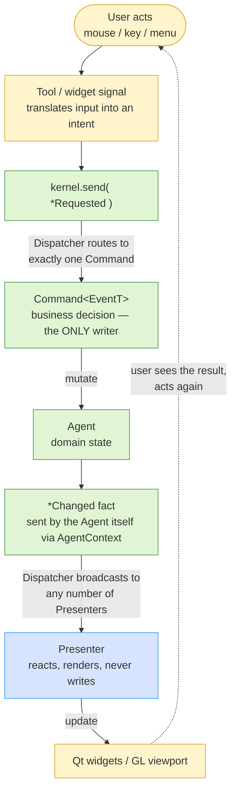

# Ordo Unidirectional Event Loop

> Standalone, vertically-laid-out companion to
> [ARCHITECTURE.md §2](ARCHITECTURE.md#2-ordo-unidirectional-event-loop) —
> the same loop, one screen, top to bottom. Use that section as the review
> gate; use this page to see or explain the flow at a glance.

Every feature follows one loop. **There is exactly one write path to domain
state.**

## One concrete round trip

Drawing an edge with the Line tool:

1. The user clicks in the viewport. `ViewportWidget` forwards the event to
   `ToolController`, which hands it to the active `LineTool`.
2. On commit, the tool sends an intent: `kernel.send(AddEdgeRequested{a, b})`.
3. The Dispatcher routes it to `AddEdgeCommand` — the only code allowed to
   mutate geometry.
4. The Command calls `GeometryApi`'s mutators (the half-edge kernel does
   the actual work).
5. `GeometryApi` — the agent whose data moved — sends the
   `GeometryChanged` fact through its `AgentContext`.
6. Every subscribed Presenter reacts: `ViewportPresenter` rebuilds the
   viewport's vertex buffers, `StatusBarPresenter` refreshes its readout.
7. The viewport repaints. The user sees the edge and acts again — the loop
   closes.

## Why unidirectional

- **Only Commands mutate Agents.** Widgets, tools, and Presenters never
  write domain state — they `send()` an intent that a Command handles.
- **Presenters only render and forward.** A Presenter reacts to `*Changed`
  facts and translates view signals into `send()` calls; it holds no domain
  state.
- **Agents hold state, not policy — and are send-only.** Business decisions
  live in Commands. An Agent cannot subscribe: `AgentContext` exposes send
  and sibling lookup only, so "Send Only, Never Listen" is compile-time
  enforced.
- **Dispatch is synchronous and single-threaded.** One intent, one Command,
  one visible state change per loop pass; no handler re-dispatches the event
  type it is handling.
- **Undo wraps the loop, it does not fork it.** A mutating intent's
  registration wraps the real Command in `UndoCaptureCommand<RealCommand,
  EventT>` — a decorator around an unchanged `execute()`. "Only Commands
  mutate" survives intact.

The result: any state change in the app can be explained by walking this
single vertical path, and any bug can be bisected against it — the wrong
value is either in the intent, the Command's decision, the Agent's state,
or the Presenter's rendering of it.

For the full write-authority contract, the sanctioned exceptions, and the
per-change checklist, see
[ARCHITECTURE.md §2](ARCHITECTURE.md#2-ordo-unidirectional-event-loop).
