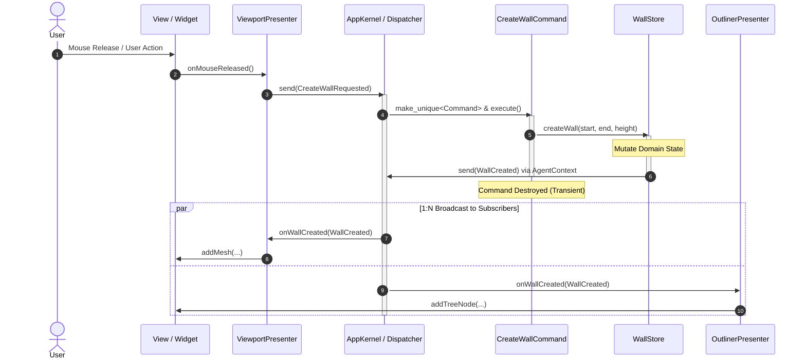

# Ordo Framework Usage Guide

Ordo is a Modern C++20 architectural framework designed for building scalable, decoupled desktop applications. It evolves the classic Proxy-Mediator-Command-Facade pattern with modern C++ idiom: compile-time typed struct events, template lambda command factories, and capability-restricted contexts.

---

## Core Concepts & Roles

| Role | Responsibility | Communication Rules |
|:---|:---|:---|
| **Event** | Plain C++ struct representing data payloads | Used for all decoupled communication |
| **Presenter** | UI adapter connecting widgets to the framework | Subscribes to Facts, sends Intents, updates UI |
| **Command** | Transient transaction orchestrating business operations | Created per event dispatch, executes, destroyed |
| **Agent** | Owner and mutator of domain state | **Send only** (publishes Facts via `AgentContext`), never subscribes |
| **AppKernel** | Central container and lifecycle manager | Owns Dispatcher, Agents, and Command registrations |

---

## The End-to-End Workflow

The framework operates in a unidirectional, four-step cycle:

### Architectural Flow

```mermaid
flowchart TD
    UI["User Interaction (View)"] -->|1. Triggers Action| P1["Presenter (Mediator)"]
    P1 -->|2. send(IntentEvent)| K["AppKernel / Dispatcher"]
    K -->|3. Instantiates & executes| CMD["Command"]
    CMD -->|4. agentAs<T>()->mutate()| ST["Domain Agent"]
    ST -->|5. send(FactEvent) via AgentContext| K
    K -->|6. 1:N Broadcast| P1
    K -->|6. 1:N Broadcast| P2["Other Presenters (Outliner, Status, etc.)"]
    P1 -->|7. Updates| UI
    P2 -->|7. Updates| OtherUI["Other UI Components"]
```

### Runtime Sequence



---

### Step 1: Define Typed Struct Events

Events are defined as lightweight, copyable or movable C++ `struct` types. They fall into two categories:

1. **Intents (`*Requested`)**: Sent by Presenters to initiate a business operation via a Command.
2. **Facts (`*Created`, `*Changed`, `*Deleted`)**: Dispatched by Agents after domain state has been mutated.

```cpp
namespace app::events {

// 1. Intent: Request to perform an action
struct CreateWallRequested {
    Point3D start;
    Point3D end;
    double height;
};

// 2. Fact: Notification that state has changed
struct WallCreated {
    uint64_t entityId;
    Point3D start;
    Point3D end;
    double height;
};

} // namespace app::events
```

---

### Step 2: Trigger a Command from UI Input

When user interaction occurs (e.g., a mouse release in the view), the Presenter captures the input and emits an Intent event.

#### 1) Emitting Intent in Presenter
```cpp
void ViewportPresenter::onMouseReleased(Point3D start, Point3D end) {
    // Send an Intent event to request wall creation
    kernel().send(events::CreateWallRequested{
        .start = start,
        .end = end,
        .height = 2.8
    });
}
```

#### 2) Registering Command to Event
During application bootstrap, bind the Intent event type to its handling Command:
```cpp
kernel.registerCommand<events::CreateWallRequested, CreateWallCommand>();
```

#### 3) Command Execution
When `kernel.send(CreateWallRequested{...})` is invoked, `AppKernel` instantiates `CreateWallCommand` and invokes its `execute` method:
```cpp
class CreateWallCommand : public ordo::core::Command<events::CreateWallRequested> {
public:
    void execute(ordo::core::AppKernel& kernel, const events::CreateWallRequested& event) override {
        auto wallStore = kernel.agentAs<WallStore>("WallStore");
        if (!wallStore) {
            return;
        }

        // Delegate mutation to domain Agent
        wallStore->createWall(event.start, event.end, event.height);
    }
};
```

---

### Step 3: Domain Mutation and Fact Emission via AgentContext

Agents encapsulate domain data and business invariants. They modify internal state and broadcast Facts to notify the rest of the application.

#### 1) Agent Implementation
```cpp
class WallStore : public ordo::core::Agent {
public:
    WallStore() : Agent("WallStore") {}

    uint64_t createWall(Point3D start, Point3D end, double height) {
        uint64_t newId = nextId_++;
        walls_.push_back(Wall{newId, start, end, height});

        // Publish Fact event through AgentContext
        send(events::WallCreated{
            .entityId = newId,
            .start = start,
            .end = end,
            .height = height
        });

        return newId;
    }

    const std::vector<Wall>& walls() const { return walls_; }

private:
    uint64_t nextId_ = 1;
    std::vector<Wall> walls_;
};
```

#### 2) Role of `AgentContext`
`Agent` does not have direct access to `AppKernel` or `Dispatcher::subscribe`. Instead, it interacts through `AgentContext`, which exposes only:
- `send(const EventT& event)`: Broadcast Fact events.
- `agent(name)` / `agentAs<T>(name)`: Access sibling Agents.

This design enforces the **"Agent: Send Only, Never Listen"** invariant at compile time.

---

### Step 4: UI Updates via Fact Subscription

Presenters subscribe to Fact events during registration and update their associated view components when events arrive.

#### 1) Subscribing in Presenter
```cpp
void ViewportPresenter::onRegister() {
    subscribe<events::WallCreated>(this, [this](const events::WallCreated& e) {
        onWallCreated(e);
    });
}
```

#### 2) Handling the Event
```cpp
void ViewportPresenter::onWallCreated(const events::WallCreated& e) {
    // Update the concrete view/widget
    view()->addMesh(e.entityId, e.start, e.end, e.height);
}
```

Multiple independent Presenters (e.g., ViewportPresenter, OutlinerPresenter, PropertyPresenter) can subscribe to the same `WallCreated` event and update their respective UI components in parallel without coupling to each other or to the Agent.

---

## Summary Checklist

When implementing a new feature in Ordo:

1. **Define Events**: Create Intent (`*Requested`) and Fact (`*Created`/`*Changed`) structs in your events namespace.
2. **Register Command**: Bind the Intent event to a `Command<IntentEvent>` via `kernel.registerCommand<Intent, Cmd>()`.
3. **Implement Agent Logic**: Mutate domain state inside the appropriate `Agent` and publish the Fact event via `send()`.
4. **Implement Presenter Logic**: Subscribe to the Fact event in `Presenter::onRegister()` and update the view component.
