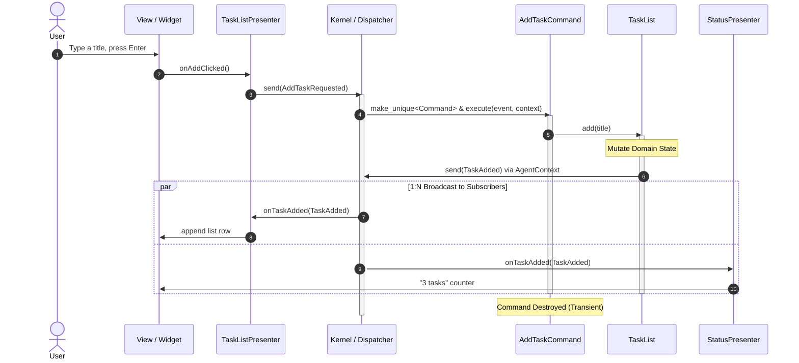

# Ordo Framework Usage Guide

Ordo is a Modern C++20 architectural framework designed for building scalable, decoupled desktop applications. It evolves the classic Proxy-Mediator-Command-Facade pattern with modern C++ idiom: compile-time typed struct events, template lambda command factories, and capability-restricted contexts.

Those four names map one-to-one onto the roles you actually write: Proxy → `Agent`, Mediator → `Presenter`, Facade → `Kernel`, Command → `Command`.

The walkthrough below builds a tiny task-list feature — a deliberately plain domain, so every line is about the framework, not the example.

*The snippets are excerpts, cut down to the line under discussion. Two examples carry the compiling version of the loop below — includes, `main()`, and the `AUTOMOC` wiring the `Q_OBJECT` adapters need. The Presenter shape is [`examples/task-list-clean/`](../examples/task-list-clean/), where the real `TaskListPresenter` takes its four widgets individually — `(input, errorLabel, list, status, root)` — rather than the one root widget these excerpts hand it. The ViewModel shape is [`examples/task-list-mvvm/`](../examples/task-list-mvvm/).*

---

## Core Concepts & Roles

| Role | Responsibility | Communication Rules |
|:---|:---|:---|
| **Event** | Plain C++ struct representing data payloads | Used for all decoupled communication |
| **Presenter** | UI adapter connecting widgets to the framework | Subscribes to Facts, sends Intents, updates UI |
| **Command** | Transient transaction orchestrating business operations | Created per event dispatch, executes, destroyed |
| **Agent** | Owner and mutator of domain state | **Send only** (publishes Facts via `AgentContext`), never subscribes |
| **Kernel** | Central container wiring the roles together | Owns the Dispatcher, Agents, Command registrations, and the three role contexts (Agent/Command/Presenter). Visible only in bootstrap wiring |

---

## The End-to-End Workflow

The framework operates in a unidirectional, four-step cycle:

### Architectural Flow

```mermaid
flowchart TD
    UI["User Interaction (View)"] -->|1. Triggers Action| P1["TaskListPresenter (Mediator)"]
    P1 -->|2. send(IntentEvent)| K["Kernel / Dispatcher"]
    K -->|3. Instantiates & executes| CMD["AddTaskCommand"]
    CMD -->|4. agentAs&lt;T&gt;()->mutate()| ST["TaskList (Agent)"]
    ST -->|5. send(FactEvent) via AgentContext| K
    K -->|6. 1:N Broadcast| P1
    K -->|6. 1:N Broadcast| P2["Other Presenters (Status, Filters, etc.)"]
    P1 -->|7. Updates| UI
    P2 -->|7. Updates| OtherUI["Other UI Components"]
```

### Runtime Sequence



The broadcast sits inside the command's activation on purpose: dispatch is
synchronous, so subscribers run to completion while `execute` is still on the
stack. Anything the command does after calling the agent happens *after* every
presenter has already reacted — see [`CommandContext`](api.md#commandcontext)
for the nested-dispatch contract.

`StatusPresenter` is illustrative and not in the repository. The real
`TaskListPresenter` is in
[`examples/task-list-clean/`](../examples/task-list-clean/), where it updates
the status label itself.

---

### Step 1: Define Typed Struct Events

Events are defined as lightweight, copyable or movable C++ `struct` types. They fall into three categories:

1. **Intents (`*Requested`)**: Sent by Presenters to initiate a business operation via a Command.
2. **Facts (`*Added`, `*Changed`, `*Removed`)**: Dispatched by Agents after domain state has been mutated.
3. **Results (`*Loaded`, `*Completed`, `*JobStarted`/`*JobProgress`/`*JobFinished`)**: outcomes from outside the kernel — a database, a worker pool, a device. A relay marshals them back onto the UI thread and `send`s them in, where a **Command** — not a Presenter — handles them and folds the payload into an Agent, which then publishes the ordinary Fact. They read like Facts but no Agent sent them, so subscribing a presenter to one is the wrong move: the view would update while the domain stayed empty. See [todomvc](examples.md#todomvc) (`TodosLoaded`, `PersistCompleted`) and [mesh-farm](examples.md#mesh-farm) (`BakeJobStarted` / `BakeJobProgress` / `BakeJobFinished`) for the worked versions.

```cpp
namespace app::events {

// 1. Intent: Request to perform an action
struct AddTaskRequested {
    std::string title;
};

// 2. Fact: Notification that state has changed
struct TaskAdded {
    std::uint64_t id;
    std::string title;
};

} // namespace app::events
```

---

### Step 2: Trigger a Command from UI Input

When user interaction occurs (e.g., pressing Enter in the input field), the Presenter captures the input and emits an Intent event.

#### 1) Emitting Intent in Presenter
```cpp
void TaskListPresenter::onAddClicked(const std::string& title) {
    // Send an Intent event to request task creation
    context().send(events::AddTaskRequested{.title = title});
}
```

#### 2) Registering Command to Event
During application bootstrap, bind the Intent event type to its handling Command — and hand Presenters to a `ViewHost`, which injects each one's `PresenterContext` at `add()`:
```cpp
kernel.registerCommand<events::AddTaskRequested, AddTaskCommand>();

ordo::qt::ViewHost host(kernel);
auto* taskListPresenter = host.add<TaskListPresenter>(taskListWidget);
auto* statusPresenter = host.add<StatusPresenter>(statusLabel);
```

#### 3) Command Execution
When `kernel.send(AddTaskRequested{...})` is invoked, `Kernel` instantiates `AddTaskCommand` and invokes `execute(event, context)` — the `CommandContext` is the command's whole view of the kernel. Business policy lives HERE, not in the Agent:
```cpp
class AddTaskCommand : public ordo::core::Command<events::AddTaskRequested> {
public:
    void execute(const events::AddTaskRequested& event, ordo::core::CommandContext& context) override {
        const std::string title = trimmed(event.title);  // whitespace-only counts as empty
        if (title.empty()) {
            return;  // policy decision: reject blank titles -- no mutation, no Fact
        }

        auto tasks = context.agentAs<TaskList>(TaskList::kName);
        if (!tasks) {
            return;
        }

        // Delegate mutation to the domain Agent
        tasks->add(title);
    }
};
```

Look agents up through the agent's own `kName` constant, never a string literal: `agentAs` returns nullptr for an unknown name and emits no diagnostic anywhere, so a mistyped `"taks"` is an undiagnosable nullptr instead of a compile error.

A rejected intent sends nothing — subscribers only ever hear about state that actually changed (the no-event-on-no-op convention).

---

### Step 3: Domain Mutation and Fact Emission via AgentContext

Agents encapsulate domain data and its invariants. They modify internal state and broadcast Facts to notify the rest of the application. Note the name: `TaskList`, not `TaskManager` — an Agent is named for the thing it IS.

#### 1) Agent Implementation
```cpp
struct Task {
    std::uint64_t id = 0;
    std::string title;
};

class TaskList : public ordo::core::Agent {
public:
    static constexpr const char* kName = "tasks";  // the lookup key, once

    TaskList() : Agent(kName) {}

    std::uint64_t add(const std::string& title) {
        const std::uint64_t newId = nextId_++;
        tasks_.push_back(Task{newId, title});

        // Publish Fact event through AgentContext
        context().send(events::TaskAdded{.id = newId, .title = title});

        return newId;
    }

    const std::vector<Task>& tasks() const { return tasks_; }

private:
    std::uint64_t nextId_ = 1;
    std::vector<Task> tasks_;
};
```

#### 2) Role of `AgentContext`
`Agent` does not have direct access to `Kernel` or `Dispatcher::subscribe`. Instead, it interacts through `AgentContext`, which exposes only:
- `send(const EventT& event)`: Broadcast Fact events.
- `agent(name)` / `agentAs<T>(name)`: Access sibling Agents.

This design enforces the **"Agent: Send Only, Never Listen"** invariant at compile time.

---

### Step 4: UI Updates via Fact Subscription

Presenters subscribe to Fact events during registration and update their associated view components when events arrive. This is where the 1:N broadcast pays off — two presenters react to the same Fact without knowing about each other or the Agent:

#### 1) Subscribing in Presenters
```cpp
void TaskListPresenter::onRegister() {
    // The PresenterContext was injected by ViewHost just before this
    // hook -- subscribe is valid from here on, never in the constructor.
    subscribe<events::TaskAdded>(&TaskListPresenter::onTaskAdded);
}

void StatusPresenter::onRegister() {
    subscribe<events::TaskAdded>(&StatusPresenter::onTaskAdded);
}
```

#### 2) Handling the Event
```cpp
void TaskListPresenter::onTaskAdded(const events::TaskAdded& e) {
    // Update the concrete view/widget (a typed pointer the presenter holds)
    listWidget_->addItem(QString::fromStdString(e.title));
}

void StatusPresenter::onTaskAdded(const events::TaskAdded&) {
    ++taskCount_;
    statusLabel_->setText(tr("%1 tasks").arg(taskCount_));
}
```

Any number of further Presenters (filters, badges, a tray icon) can join by subscribing to the same `TaskAdded` — no existing code changes.

---

## Putting It Together: The Bootstrap

Steps 1–4 are feature code. This is the wiring that starts them — the only place `Kernel` is named, and the answer to how `agentAs<TaskList>(TaskList::kName)` finds anything: you register the agent, under its own `name()`.

```cpp
#include <memory>

#include <QApplication>

#include <ordo/core/kernel.h>
#include <ordo/qt/view_host.h>

#include "model/task_commands.h"
#include "model/task_events.h"
#include "model/task_list.h"

int main(int argc, char** argv) {
    QApplication application(argc, argv);

    // Bootstrap: the only place Kernel appears.
    ordo::core::Kernel kernel;
    kernel.registerAgent(std::make_shared<TaskList>());  // keyed by TaskList::kName

    // The window is declared BEFORE the host: locals die in reverse
    // declaration order, so the host -- and the Presenters it owns -- is torn
    // down before the widgets those Presenters write into.
    QWidget window;
    auto* column = new QVBoxLayout(&window);
    auto* taskListWidget = new QListWidget;
    auto* statusLabel = new QLabel(QStringLiteral("0 tasks"));
    column->addWidget(taskListWidget);
    column->addWidget(statusLabel);

    // add() constructs the adapter, injects its PresenterContext, then calls
    // onRegister() -- which is why subscribe belongs there, not in a ctor.
    ordo::qt::ViewHost host(kernel);
    host.add<TaskListPresenter>(taskListWidget);
    host.add<StatusPresenter>(statusLabel);

    kernel.registerCommand<events::AddTaskRequested, AddTaskCommand>();
    // A command with a dependency -- the output port of "Clean Architecture
    // Ports" below -- gets it by reference through the same call:
    //   kernel.registerCommand<events::AddTaskRequested, AddTaskCommand>(std::ref(*port));

    window.show();
    const int exitCode = application.exec();

    // Teardown: a factory that captured a reference must be dropped before
    // the referent dies. Harmless without one, and the habit keeps it correct.
    kernel.removeCommand<events::AddTaskRequested>();
    return exitCode;
}
```

Order is the one thing that bites: an agent must be registered before a command looks it up, and an adapter only has a context after `ViewHost::add()` returns.

Nothing in that block *starts* the application. Registration is composition-root
code: it makes the loop available, it does not run it. Startup behaviour is an
ordinary intent, sent as bootstrap's last step —
[`examples/todomvc/main.cpp`](../examples/todomvc/main.cpp) registers its
commands and then does
`kernel.send(app::events::LoadTodosRequested{})`, which takes the same path any
button press would and opens the window mid-action (rows being read back) instead
of on a guaranteed-empty list. There is no startup hook to implement; the first
event is just an event.

The Presenter shape of this block, compiling, is
[`examples/task-list-clean/main.cpp`](../examples/task-list-clean/main.cpp) —
one presenter built from its four widgets, and the output port of "Clean
Architecture Ports" below already wired as `std::ref(*presenter)`. The ViewModel
shape is [`examples/task-list-mvvm/main.cpp`](../examples/task-list-mvvm/main.cpp),
where the declaration order flips (the window *reads* the view-model, so it is
declared after the host).

---

## Multi-Document Applications

One kernel per document. `Kernel` is instantiable and never a singleton, so
several kernels coexist in one process sharing no dispatcher, no agents and no
command registrations — a second document is the bootstrap block above, run
again over its own state.

Switching the active document therefore means destroying that document's
`ViewHost` and every adapter under it and building new ones against the other
kernel, not rebinding the existing ones. The code makes rebinding impossible on
purpose: [`ViewHost`](api.md#viewhost) holds its kernel's `PresenterContext` as
a reference member and is non-copyable and non-assignable, and
`ViewAdapter::setContext` is locked behind a passkey only `ViewHost::add()` can
mint. An adapter's kernel is fixed from `add()` until its destructor, which
unsubscribes everything it subscribed. Read that as a guarantee rather than a
limit: no adapter can ever straddle two documents, writing document A's widgets
in response to document B's facts, because there is no expressible way to point
it at a second kernel.

Anything that spans documents — a document list, "close all", moving an item
from one document into another — lives above both kernels, in the composition
root that owns them. It reads one kernel and sends an intent into the other;
neither kernel gains a reference to its sibling.

None of the shipped examples need more than one kernel at a time -- each
opens a single document and stops there -- so the model above is described
rather than pointed at a worked example.

---

## The Same Feature, MVVM Style

Everything up to the view is unchanged — same events, same command, same
agent. Only the view adapter differs: instead of a Presenter poking widgets,
a `ViewModel` exposes observable state and lets the view bind to it. A
ViewModel carries no reference to any view; that absence is the point.

```cpp
class TaskListViewModel : public ordo::qt::ViewModel {
    Q_OBJECT
    Q_PROPERTY(int count READ count NOTIFY countChanged)

public:
    TaskListViewModel() : ViewModel(QStringLiteral("TaskListViewModel")) {}

    void onRegister() override { subscribe<events::TaskAdded>(&TaskListViewModel::onTaskAdded); }

    int count() const { return count_; }

public slots:
    void addTask(const QString& title) { context().send(events::AddTaskRequested{title.toStdString()}); }

signals:
    void countChanged(int count);
    void taskAdded(const QString& title);

private:
    void onTaskAdded(const events::TaskAdded& e) {
        ++count_;
        emit taskAdded(QString::fromStdString(e.title));
        emit countChanged(count_);
    }

    int count_ = 0;
};
```

With widgets, the binding is a pair of connects per direction:

```cpp
auto* viewModel = host.add<TaskListViewModel>();   // same ViewHost as Presenters

QObject::connect(addButton, &QPushButton::clicked,
                 [=] { viewModel->addTask(input->text()); });
QObject::connect(viewModel, &TaskListViewModel::countChanged,
                 [=](int n) { status->setText(QString("%1 tasks").arg(n)); });
```

With QML the properties bind declaratively:

```qml
Label { text: taskListViewModel.count + " tasks" }
Button { onClicked: taskListViewModel.addTask(input.text) }
```

`examples/task-list-mvvm/` is this feature as a runnable app (plus a
`--smoke` flag that drives the loop headless and exits 0).

---

## Clean Architecture Ports, the Ordo Way

Clean Architecture's use-case ports map onto Ordo almost entirely through
things it already has. The one genuinely new move is the **output port** for
caller-directed results — and it is a usage pattern, not framework machinery.

| Clean Architecture | Ordo | Notes |
|:---|:---|:---|
| Controller | view signal handler / VM slot | sends the intent event |
| **Input port** | the intent event **type** | `registerCommand` is the binding; no interface needed — the sender does not even know a handler exists |
| Use case interactor | `Command<EventT>` | transient, stateless, policy lives here |
| **Output port** | an interface the Command receives at registration | this section |
| Presenter (Clean's term) | the port implementation (often a ViewModel) | or any bootstrap-owned adapter |
| Entity | `Agent` | never sees a port — stays send-only |
| Dependency rule | already satisfied | the port interface lives domain-side; the view implements it |

### When a port earns its keep

Facts broadcast 1:N — the right shape for state anyone may observe. But some
results belong to exactly one caller: a validation failure shown next to the
input that caused it. Broadcasting those forces every subscriber to filter.
An output port delivers them 1:1, and the two channels coexist in one
command:

```cpp
class AddTaskCommand : public ordo::core::Command<events::AddTaskRequested> {
public:
    explicit AddTaskCommand(TaskOutput& output) : output_(output) {}

    void execute(const events::AddTaskRequested& event, ordo::core::CommandContext& context) override {
        const std::string title = trimmed(event.title);
        if (title.empty()) {
            output_.taskRejected("title is empty");   // 1:1 -- nobody else hears this
            return;                                   // no mutation, no fact
        }
        const auto id = context.agentAs<TaskList>(TaskList::kName)->add(title);  // agent sends TaskAdded (1:N)
        output_.taskAccepted(id, title);              // 1:1 echo to the caller
    }
    // ...
};
```

The interface lives in the domain module (the dependency arrow points
inward); the view side implements it — in the example, the ViewModel itself,
so rejections land as an observable `lastError` property:

```cpp
kernel.registerCommand<events::AddTaskRequested, AddTaskCommand>(std::ref(*viewModel));
```

`registerCommand` forwards constructor arguments to every per-dispatch
construction — that forwarding is the only framework involvement.

### The lifetime rule

The event bus auto-unsubscribes by owner cookie; a port has no such net. The
factory holds the port reference for as long as the command stays
registered, so **the implementation must outlive the registration — call
`removeCommand<EventT>()` before it dies**, or own the port at bootstrap
scope. `examples/task-list-mvvm/` shows the full wiring, teardown included.

---

## Testing Your Feature

`Kernel` is instantiable and never a singleton, and two instances share
nothing — so a test builds its own, registers only the agents it cares about,
sends an intent, and asserts on the agent (and, when the command has an output
port, on what that port recorded). No view, no event loop, no fixture. The types
below are `examples/task-list-mvvm/`'s, used as that example declares them:

```cpp
// AddTaskCommand takes its output port by reference (model/task_commands.h:
// explicit AddTaskCommand(TaskOutput&)), so the test supplies the smallest
// implementation that satisfies it -- the example passes its view-model here.
struct RecordingOutput : app::TaskOutput {
    void taskRejected(const std::string& reason) override { rejections.push_back(reason); }
    void taskAccepted(std::uint64_t, const std::string& title) override { accepted.push_back(title); }

    std::vector<std::string> rejections;
    std::vector<std::string> accepted;
};

TEST(TaskList, TrimsAndAppends) {
    RecordingOutput output;   // declared first: the port must outlive the registration
    ordo::core::Kernel kernel;
    auto tasks = std::make_shared<app::TaskList>();
    kernel.registerAgent(tasks);
    kernel.registerCommand<app::events::AddTaskRequested, app::AddTaskCommand>(std::ref(output));

    kernel.send(app::events::AddTaskRequested{.title = "  ship ordo  "});

    ASSERT_EQ(tasks->tasks().size(), 1u);
    EXPECT_EQ(tasks->tasks().front().title, "ship ordo");  // the 1:N fact channel
    EXPECT_EQ(output.accepted.size(), 1u);                 // the 1:1 echo
}

TEST(TaskList, RejectsABlankTitle) {
    // ... same setup ...
    kernel.send(app::events::AddTaskRequested{.title = "   "});

    EXPECT_TRUE(tasks->tasks().empty());      // no mutation, and no Fact was sent
    EXPECT_EQ(output.rejections.size(), 1u);  // the caller alone hears why
}
```

Dispatch is synchronous, so there is nothing to await: `send` returns only
after the command ran, the agent mutated, and every subscriber was called.

This is exactly what each example's `--smoke` flag does — send, then assert on
what the agent ended up holding (or, in `task-list-mvvm`, on what the
view-model observed through the output port) and exit non-zero on failure.
They are this pattern with `fprintf` in place of `EXPECT_*`.

Testing a **view adapter** needs no application object either: `Presenter`
and `ViewModel` are plain `QObject`s, and ordo's own adapter tests construct
them without one (the package check's comment even notes a `QCoreApplication`
is enough when you want an event loop). Reach for a `QApplication` or
`QGuiApplication` only once real widgets or a QML engine join the test.
Nothing else changes: a `ViewHost` on the test kernel,
`host.add<TaskListViewModel>()`, `kernel.send(...)`, assert on the observable
state.

---

## Summary Checklist

When implementing a new feature in Ordo:

1. **Define Events**: Create Intent (`*Requested`) and Fact (`*Added`/`*Changed`) structs in your events namespace.
2. **Register Command**: Bind the Intent event to a `Command<IntentEvent>` via `kernel.registerCommand<Intent, Cmd>()`. Policy decisions (validation, rejection, no-ops) live in the Command.
3. **Implement Agent Logic**: Mutate domain state inside the appropriate `Agent` and publish the Fact event via `context().send()`.
4. **Implement Presenter Logic**: Subscribe to the Fact event in `Presenter::onRegister()` and update the view component.
